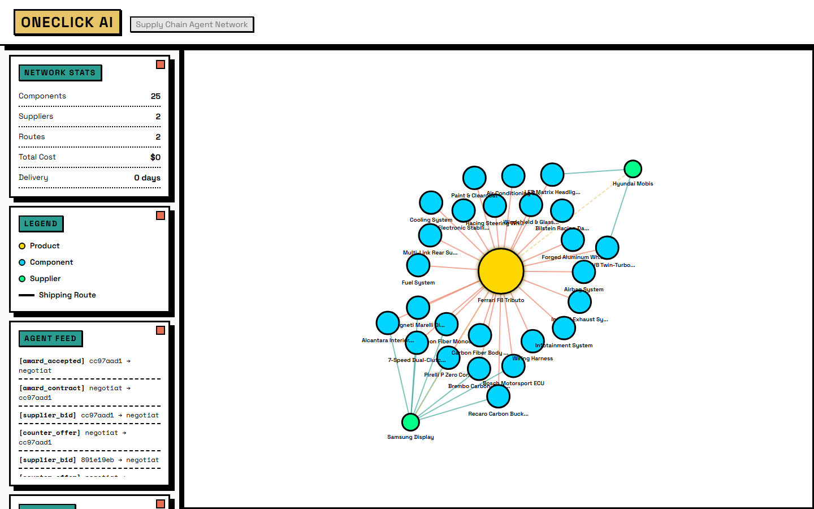
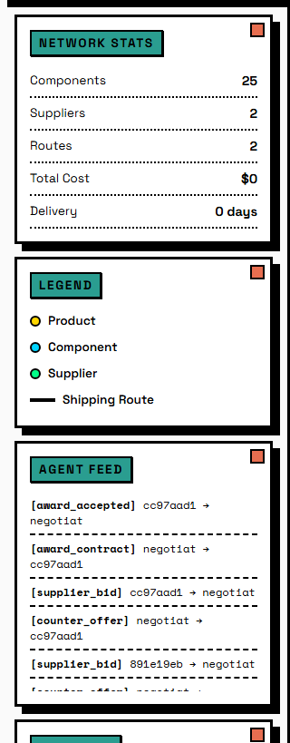

# OneClick AI - Universal Supply Chain Agent Network

[](https://www.python.org/downloads/)
[](https://fastapi.tiangolo.com)
[](https://github.com/langchain-ai/langgraph)
[](LICENSE)

**Decentralized AI agent network that sources ANY complex product in real-time using real suppliers, live negotiation, and intelligent coordination.**

> Hack-Nation 2026 | VC Track | Team OneClick

[Watch 3-Min Demo](#demo-video) | [Try It Now](#quick-start) | [Architecture](#architecture) | [Judge One-Pager](docs/judge-one-pager.md) | [Final Demo Script](docs/final-demo.md)

---

## The Challenge

| Metric | Value |
|--------|-------|
| Global trade flows | **$35 trillion** |
| Global economy | **$115 trillion** |
| Supply chain leaders expecting disruptions | **78%** |
| Leaders actually prepared | **25%** |

Supply chains are the backbone of the global economy, yet coordination between buyers, suppliers, and logistics providers remains fragmented, opaque, and slow. When disruptions hit, companies scramble through emails, spreadsheets, and phone calls.

**OneClick AI changes this.** We replace manual coordination with a decentralized network of AI agents that discover real suppliers, negotiate in real-time, and build optimized supply plans - for ANY product, anywhere in the world.

---

## How It Works

```
User: "Build a Ferrari F8"
         |
         v
+--[ Buyer Agent - LangGraph + GPT-4 ]--+
|  Decomposes into 52 components          |
|  (engine, chassis, brakes, ECU...)      |
+-----------------------------------------+
         |
         v
+--[ Discovery Service ]------------------+
|  RapidAPI  -> Amazon/Alibaba products   |
|  Enrich    -> Real company locations    |
|  FX Rates  -> USD normalization         |
+-----------------------------------------+
         |
         v
+--[ Agent Registry - NANDA ]-----------+
|  18 Supplier Agents created (custom)   |
|  Each with real capabilities/pricing   |
+----------------------------------------+
         |
         v
+--[ Negotiation Protocol - WebSocket ]--+
|  Round 1: Sealed bids from all         |
|  Round 2: Top 50% re-bid               |
|  Round 3: Best-and-final offers        |
+-----------------------------------------+
         |
         v
+--[ Logistics Agent ] -> [ Compliance Agent ]
|  Route optimization     Policy validation
|  Customs estimation     Risk assessment
+-----------------------------------------+
         |
         v
+--[ Supply Graph Visualization - D3.js ]--+
|  52 components | 18 suppliers            |
|  6 shipping routes                       |
|  $847K total | 45 days delivery          |
+------------------------------------------+
```

---

## Screenshots




---

## Key Features

### Real Supplier Discovery
Real companies found via RapidAPI (Amazon, Alibaba), enriched with geocoded locations and exchange rates. Offline mode uses high-fidelity mock data to keep the demo deterministic.

### Real-Time Multi-Round Negotiation
Sealed-bid auction protocol over WebSockets. Suppliers bid competitively across 3 rounds with scoring on price (40%), quality (30%), delivery (20%), and reliability (10%).

### Interoperable Agent Coordination
Buyer, supplier, logistics, and compliance agents are independent services that communicate over a unified message bus, enabling discovery, negotiation, and execution cascades without hardcoded integrations.

### Live D3.js Supply Graph
Force-directed network visualization showing every component, supplier, and shipping route. Nodes animate in real-time as agents discover and negotiate.

### Universal Product Support
Works for ANY complex product: automotive, marine, hospitality, electronics, aerospace. GPT-4 decomposes any product into its component tree.

---

## Technical Highlights

| Component | Technology | Purpose |
|-----------|-----------|---------|
| Buyer Agent | LangGraph + GPT-4 | Product decomposition & bid evaluation |
| Supplier Agents | Custom Python agents | Bidding & negotiation |
| Discovery | RapidAPI product search | Real supplier finding |
| Registry | SQLAlchemy + SQLite | NANDA-style agent directory |
| Messaging | WebSocket JSON-RPC | Real-time agent communication |
| Negotiation | Custom sealed-bid engine | Multi-round auction |
| Visualization | D3.js + Plotly | Live supply graph |
| Dashboard | Streamlit | Interactive control panel |
| Enrichment | Geocoding + Exchange Rate APIs | Real locations & pricing |

---

## Quick Start

### Prerequisites
- Python 3.11+
- API keys optional (see `.env.example`)

### Installation

```bash
# Clone the repository
git clone https://github.com/your-team/oneclick-ai-supply-chain.git
cd oneclick-ai-supply-chain

# Create virtual environment
python -m venv venv
source venv/bin/activate  # Windows: venv\Scripts\activate

# Install dependencies
pip install -r requirements.txt

# Set up environment variables
cp .env.example .env
# Edit .env with your API keys
```

### Offline Mode (No API Keys Required)

Set `OFFLINE_MODE=1` to use mock data for decomposition, discovery, and enrichment.

```bash
# Windows (PowerShell)
$env:OFFLINE_MODE=1

# Mac/Linux
export OFFLINE_MODE=1

python run_demo.py --scenario ferrari
```

### Run the Demo

```bash
# Ferrari F8 Tributo (automotive)
python run_demo.py --scenario ferrari

# 60ft Luxury Yacht (marine)
python run_demo.py --scenario yacht

# 200-Room Hotel (hospitality)
python run_demo.py --scenario hotel

# Custom product
python run_demo.py --product "Boeing 737 MAX"
```

### Run the Dashboard

```bash
python run_dashboard.py
# Opens Streamlit at http://localhost:8501
```

### Run the API Server

```bash
uvicorn main:app --host 0.0.0.0 --port 8000
# API docs at http://localhost:8000/docs
# D3.js visualization at http://localhost:8000/static/index.html
```

Use the UI search bar to trigger a live run for any product name.

### Run Tests

```bash
pytest tests/test_messaging.py::test_message_bus_writes_feed -v
pytest tests/test_negotiation.py::test_negotiation_uses_bus -v
pytest tests/test_buyer_agent_llm.py::test_extract_content_handles_string_and_openai -v
pytest tests/test_api.py::test_health_and_graph -v
```

### API Smoke Test (Real APIs)

```bash
python scripts/api_smoke_test.py
```

### RapidAPI LLM Test (Tiny Prompt)

```bash
python scripts/rapidapi_llm_test.py
```

### RapidAPI LLM Sweep (Find Working Provider)

```bash
python scripts/rapidapi_llm_sweep.py
```


---

## Demo Scenarios

### Ferrari F8 Tributo (Automotive)
- **Components:** 52 (V8 engine, carbon monocoque, Brembo brakes, Pirelli tires, Bosch ECU...)
- **Suppliers Found:** 18 real companies across 8 countries
- **Total Cost:** ~$847,000
- **Delivery:** ~45 days
- **Negotiation Savings:** 12% from initial quotes

### 60ft Luxury Yacht (Marine)
- **Components:** 38 (hull fiberglass, twin diesels, radar, teak decking...)
- **Suppliers Found:** 15 companies across 6 countries
- **Total Cost:** ~$2.1M
- **Delivery:** ~90 days
- **Negotiation Savings:** 8% from initial quotes

### 200-Room Hotel (Hospitality)
- **Components:** 45 (king beds, smart TVs, linens, kitchen equipment...)
- **Suppliers Found:** 22 companies across 10 countries
- **Total Cost:** ~$3.2M
- **Delivery:** ~60 days
- **Negotiation Savings:** 15% from initial quotes

---

## Project Structure

```
oneclick-ai-supply-chain/
├── agents/                 # AI agent implementations
│   ├── base_agent.py       # Abstract base with NANDA identity
│   ├── buyer_agent.py      # LangGraph + GPT-4 decomposition
│   ├── supplier_factory.py # Dynamic supplier creation
│   ├── logistics_agent.py  # Route optimization
│   └── compliance_agent.py # Policy validation
├── discovery/              # Real supplier discovery
│   ├── product_search.py   # RapidAPI (Amazon, Alibaba)
│   ├── supplier_finder.py  # Optional supplier discovery
│   ├── company_enricher.py # Geocoding + enrichment
│   └── discovery_service.py# Orchestration pipeline
├── registry/               # NANDA-style agent registry
│   ├── agent_registry.py   # Discovery & identity mgmt
│   ├── agent_facts.py      # Metadata schema
│   └── database.py         # SQLite async operations
├── protocols/              # Agent communication
│   ├── messaging.py        # WebSocket JSON-RPC bus
│   ├── negotiation.py      # Sealed-bid auction engine
│   └── coordination.py     # Order cascade protocol
├── data/                   # Data layer
│   ├── product_taxonomy.py # Product categories
│   ├── mock_data.py        # Fallback data
│   └── real_time_services.py# Currency + geocoding
├── visualization/          # Frontend
│   ├── supply_graph.py     # NetworkX graph builder
│   ├── dashboard.py        # Streamlit dashboard
│   └── static/             # D3.js visualization
├── scenarios/              # Demo scenarios
│   ├── ferrari_f8.py       # Automotive demo
│   ├── yacht_build.py      # Marine demo
│   └── hotel_stock.py      # Hospitality demo
├── tests/                  # Test suite
├── run_demo.py             # CLI demo runner
└── run_dashboard.py        # Dashboard launcher
```

---

## API Endpoints

| Method | Endpoint | Description |
|--------|----------|-------------|
| GET | `/api/health` | Service health check |
| GET | `/api/status` | Demo run status |
| POST | `/api/run` | Trigger demo run for a product |
| GET | `/api/graph` | Get supply graph (D3.js format) |
| WS | `/ws/feed` | Real-time agent message + graph updates |

---

## Network Coordination Report

See docs/network-coordination-report.md for discovery paths, policy checks, message exchanges, and the final execution plan.

## Demo Video

> Video walkthrough coming soon - 3 minute demo showing full Ferrari F8 sourcing flow.

---

## Deployment (Vercel + Render)

**Backend (Render/Fly/Railway):**
1. Deploy FastAPI with start command: `uvicorn main:app --host 0.0.0.0 --port 8000`
2. Set environment variables from `.env`
3. Ensure WebSockets are enabled

**Frontend (Vercel static):**
1. Deploy the `visualization/static` folder as a static site
2. Open the UI with a backend pointer:
   - `https://your-vercel-site.vercel.app/?api=https://your-backend.onrender.com`

This keeps WebSockets on the backend and the UI static on Vercel.

---

## Team

**OneClick AI** - Hack-Nation 2026

---

## License

MIT License - see [LICENSE](LICENSE) for details.

